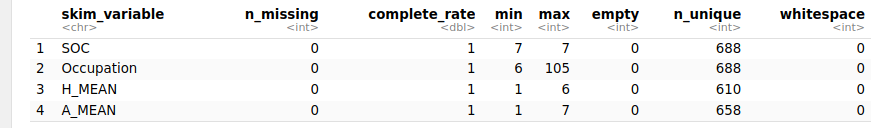
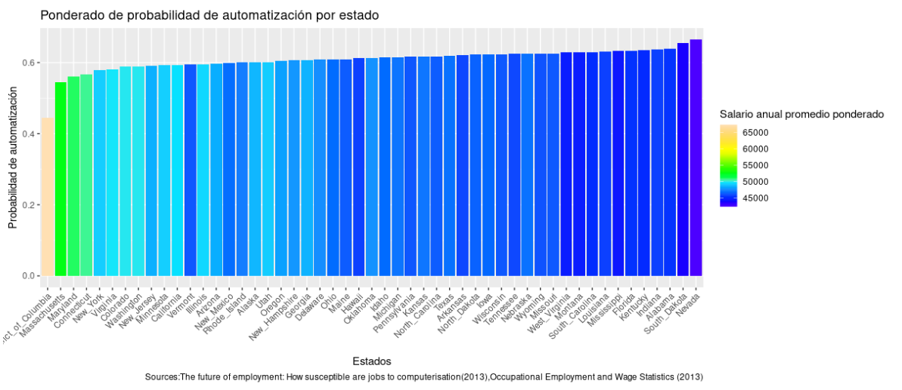
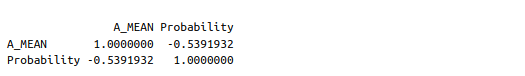
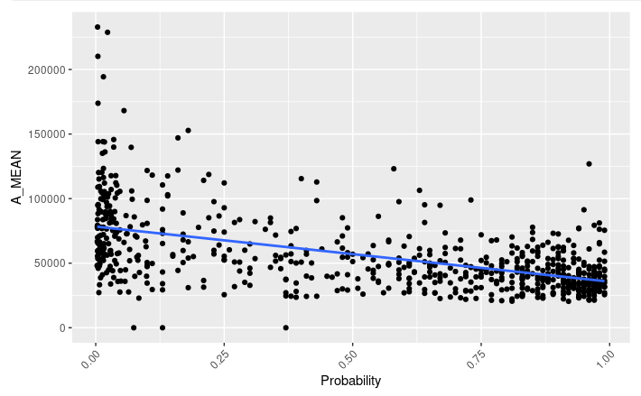

# Analisis_en_la_Automatizacion-de-Ocupaciones-en-Estados-Unidos
El análisis busca entender cómo la automatización laboral afecta el desempleo en diversas ocupaciones de la población en los Estados Unidos. Combina datos historicos del estudio: The future of employment: "How susceptible are jobs to computerisation" (2013) y los datos históricos abiertos "Occupational Employment and Wage Statistics" (2013).


📘 Tabal de contenido
* [Pregunta Empresarial](#pregunta)
* [Preparando](#preparando)
* [Procesando](#procesando)
* [Análisis](#analizando)
* [Visualización](#visualizando)
* [Actuar](#actuar)

## Pregunta

#### Escenario

Una organización sin fines de lucro, tiene como misión abordar los crecientes desafíos del empleo en la sociedad contemporánea, especialmente en un contexto donde la automatización laboral está transformando rápidamente el panorama económico. Esta organización está dedicada a entender cómo los avances tecnológicos están impactando las tasas de desempleo en distintos segmentos de la población en los Estados Unidos y a desarrollar estrategias efectivas para mitigar sus efectos negativos.


#### Preguta Empresarial

¿Qué tipo de ocupacioness son más propensas a automatizarse, en que estados y si tiene alguna relación con el promedio salarial ?

Dado que la automatización de la mano de obra es el enfoque central de este análisis, resulta esencial adquirir un conjunto de datos que contenga la probabilidad de automatización de las ocupaciones por estado. A partir de esta base, podremos llevar a cabo comparaciones y determinar qué puestos de trabajo podrían ser sujetos de automatización, lo que en última instancia contribuirá a la reducción de los costos laborales.

## Preparando 

En la busqueda de dataset encuentro uno que integra datos del estudio: The future of employment: How susceptible are jobs to computerisation(2013) y y los datos históricos abiertos "Occupational Employment and Wage Statistics" (2013 ): [Fuente de los datos](https://www.kaggle.com/datasets/andrewmvd/occupation-salary-and-likelihood-of-automation)

### Importando datos en SQL

Verificando si hay datos nulos e indagar si se pueden completar

```sql
-- Primer Dataset
SELECT *
FROM 
  `automated_jobs.occupation_salary`
WHERE 
  OCC_CODE IS NULL OR
  OCC_TITLE IS NULL OR
  OCC_GROUP IS NULL OR
  TOT_EMP IS NULL OR
  H_MEAN IS NULL OR
  A_MEAN IS NULL 

-- Segundo Dataset
SELECT * 
FROM 
  `automated_jobs.automated_jobs_by_state`
WHERE 
  SOC IS NULL OR
  Occupation IS NULL OR
  Probability IS NULL 

```
Se encontrarón varios dato nulos, donde no había información o habían menos de 10 empleados, estos no se considerarón.

Verificando que los datos esten correctos

```sql
-- Comprobando que el código OCC este dentro de los 7 caracteres, que la probabilidad este dentro de la unidad 
SELECT
  SOC,
  Probability

FROM
  `automated_jobs.automated_jobs_by_state`

WHERE
  LENGTH(SOC) > 7 OR Probability < 0 OR Probability > 1

-- Seleccionando los datos que no esten duplicados

SELECT DISTINCT *
FROM
  `automated_jobs.automated_jobs_by_state`
```

Fusionando los datasets

```sql
SELECT
  automatedJobs.*,
  occupationSalary.TOT_EMP,
  occupationSalary.H_MEAN,
  occupationSalary.A_MEAN
FROM
  `automated_jobs.automated_jobs_by_state` AS automatedJobs
INNER JOIN
  `automated_jobs.occupation_salary` AS occupationSalary ON
  automatedJobs.SOC = occupationSalary.OCC_CODE
ORDER BY
  automatedJobs.SOC ASC
```

Se obtiene un único dataset, que es mucho mejor manipular


### Importando Dataset en R

```{r}
automated_jobs_df <- read_csv("automated_jobs_and_salary_DatasetMergeSQL.csv")
```


Verificando la estructura de los datos

```{r}
str(automated_jobs_df)
```

Se puede observar en que las variables si corresponde al formato deseado, pero es importante revisar cuatro de ellas es H_MEAN, A_MEAN, SOC, OCCUPATION.


```{r}
skim_without_charts(automated_jobs_df)
```


Los valores unicos en en H_MEAN y A_MEAN no completan los 688 retros

## Procesando

Usando la funcion !grepl() se encuentra valores que son formato chr que no correspon, Se observan en 21 celdas varios simbolos asteriscos son datos asterisco respondiente al numero de empleados por estada, eso es porque la ocupacion tenia menos de 10 empleados, por lo tamto no se considera relevante. Procedo a reemplazarlos por cero.

```{r}
automated_jobs_mod_df <- automated_jobs_df %>%
  mutate(H_MEAN = gsub("\\*","0",H_MEAN), A_MEAN = gsub("\\*","0",A_MEAN) )
```

Reemplazo el formato chr a dbl

Remplazado las columnas H_MEAN y A_MEAN, de formato de  caracteres (chr) a formato numerico (dbl)

```{r}
automated_jobs_mod_df <- automated_jobs_mod_df %>%
  mutate(H_MEAN = as.numeric(gsub(",","" , H_MEAN)), A_MEAN = as.numeric(gsub(",", "", A_MEAN)))
head(automated_jobs_mod_df)
```


En cuanto a a la Limpiando espacios en blanco en todas las columnass, en la revision usando el paquete skimr, se puede observar no se identifico ningun espacio en blanco en las dveriables.


Eliminando datos duplicados, aunque el analisis de estructura muestra que la culumna usando el paquete skimr, tiene 688 filas y cada una de ellas es única


```{r}
automated_jobs_mod_df <- automated_jobs_mod_df %>%
  distinct(.keep_all = TRUE) 
```

Al observar , se puede ver que no hay ningun cambio en el número de filas por lo cual no hay datos completamente duplicados


## Analizando 

Cambio de un formato ancho a uno largo

```{r}
large_automated_job <- automated_jobs_mod_df %>%
  pivot_longer(
    cols = Alabama:Wyoming,
    names_to = "State",
    values_to = "n_Jobs"
  )

```


Total de empleo y la probabilidad de automatizaicion por estado

```{r}
summary_automated_jobs <- automated_jobs_large_df %>%
  group_by(State,Occupation) %>%
  summarize(Total_jobs_state =  sum(n_Jobs),Probability = mean(Probability),
            H_MEAN = mean(H_MEAN),
            A_MEAN = mean(A_MEAN), SOC =first(SOC), .groups = "drop") 

```


probabilidad de autoamtización, salario por hora, salario anual, ponderado por estado

```{r}
summary_automated_jobs_by_state <- automated_jobs_large_df %>%
  group_by(State) %>%
  summarize(Total_jobs_state = sum(n_Jobs),
            Weighted_Probability = weighted.mean(Probability, n_Jobs),
            Weighted_H_MEAN = weighted.mean(H_MEAN, n_Jobs),
            Weighted_A_MEAN = weighted.mean(A_MEAN, n_Jobs),
            .groups = "drop")
```


probabilidad de automatizacion, salario por hora, salario anual, por ocupación


```{r}
summary_automated_jobs_by_occupation  <-automated_jobs_large_df %>%
  group_by(Occupation) %>%
  summarize(Total_jobs_state =  sum(n_Jobs),Probability = mean(Probability),
            H_MEAN = mean(H_MEAN),
            A_MEAN = mean(A_MEAN), .groups = "drop")
```


## Visualizando

Genero una visualización interactiva para los datos.
### Visualización en Tableau
#### [Ver Visualización](https://public.tableau.com/views/ExplorandolaTransformacinLaboralAutomatizacindeOcupacionesenEstadosUnidos/AutomatizacindetrabajosenUSAporOcupacinyponderadaporEstado?:language=en-US&:display_count=n&:origin=viz_share_link)

En la visualización interactiva se puede notar un patrón entre el salario y la probabilidad de automatización, genero una visualización estática para validar esta apreciación.

--

*Probabilidad ponderada por estado*
```{r}
ggplot(data = summary_automated_jobs_by_state ) + geom_col(mapping = aes(x = reorder(State,Weighted_Probability ), y = Weighted_Probability , fill = Weighted_A_MEAN ))+ scale_fill_gradientn(colors = topo.colors(18))  + theme(axis.text.x = element_text(angle = 45, hjust = 1)) + labs(title = "Ponderado de probabilidad de automatización por estado", x = "Estados", y= "Probabilidad de automatización", caption = "Sources:The future of employment: How susceptible are jobs to computerisation(2013),Occupational Employment and Wage Statistics (2013)" )
```



Interesante descubrimiento los estados donde sus trabajadores tienen un ingreso promedio anual superior a 50,000 dolares tiene una probabilidad de automatizacion que es igual  inferion al 60% por el contrario los estados donde el promedio anual  inferior a 50,000 tienen una probabilidad mayor al 60% de que los trabajos se automaticen.

Los estados que tiene puestos de trabajo con probabilidad de automatización de l 60% son los que tienen un salario medio anual más bajo que es inferior a 50,00 dolares.


*¿Habrá una correlación entre el salario anual y la probabilidad de automatización?*

```{r}
summary_automated_jobs_by_occupation %>%
  select(A_MEAN, Probability) %>%
  cor()
```



Hay una correlación negativa moderada, lo que significa que cuando la probabilidad de automatización aumenta el salario anual es menor. O lo opuesto cuando el salario es mayor la probabilidad de automatizacion disminuye.


*Visualización los data point y la linea de tendencia*

```{r}
ggplot(data = summary_automated_jobs_by_occupation) +
  geom_point(mapping = aes(x = Probability, y = A_MEAN)) +
  geom_smooth(mapping = aes(x = Probability, y = A_MEAN), method = "lm", se = FALSE) +
  labs(x = "Probability", y = "A_MEAN") +
  theme(axis.text.x = element_text(angle = 45, hjust = 1))

```




En este caso, a medida que aumenta la probabilidad de automatización ("Probability"), la media del salario anual ("A_MEAN") tiende a disminuir. Esto podría interpretarse como que las ocupaciones con una alta probabilidad de automatización tienden a tener salarios anuales más bajos en promedio, mientras que las ocupaciones con una baja probabilidad de automatización tienden a tener salarios anuales más altos en promedio.


## Actuar

Se pueden destacar 3 conclusiones claves del análisis entre la probabilidad y el salario

* Se observa una **relación inversa entre la probabilidad de automatización y el salario promedio anual**. Las ocupaciones con una alta probabilidad de automatización tienden a tener salarios anuales más bajos, mientras que aquellas con una baja probabilidad de automatización tienden a tener salarios más altos. Esto sugiere que la automatización podría tener un impacto negativo en los empleos de salarios más bajos.*Relación entre Estados:* Los estados con trabajadores que tienen ingresos promedio anuales superiores a $50,000 tienen una probabilidad de automatización inferior al 60%. Por el contrario, los estados con ingresos promedio anuales inferiores a 50,000 tienen una probabilidad de automatización superior al 60%. Esto indica que los estados con salarios más bajos podrían enfrentar un mayor riesgo de automatización.

* En estados con una economía laboral más diversificada, **existen ocupaciones con diferentes niveles de riesgo de automatización**, quiere decir, que los estados con más empleos tienen una gama más amplia de probabilidades de automatización en diferentes ocupaciones, como California, Texas y New York.
 

* Los **estados con un gran número de empleos podrían enfrentar desafíos más complejos relacionados con la automatización**. A medida que la automatización avanza, es posible que ciertas ocupaciones en los estados de California, Texas y New York se vuelvan más vulnerables a la reestructuración debido a la mayor variedad de ocupaciones y, por lo tanto, una mayor variabilidad en la probabilidad de automatización.

#### Recomendaciones

**Estrategias Diferenciadas por Estado**: Desarrollar estrategias personalizadas para abordar el desempleo causado por la automatización en diferentes estados. Dado que la relación entre el total de empleos por estado y la probabilidad de automatización varía, es esencial adaptar las soluciones a las realidades laborales únicas de cada región. Esto puede implicar la identificación de ocupaciones específicas en riesgo y la creación de programas de capacitación y apoyo que se ajusten a las necesidades particulares de empleo y reemplazo laboral en cada estado.

**Inversión en Capacitación Continua**: Promover la capacitación y educación continua para los trabajadores en ocupaciones con mayor riesgo de automatización. Enfocar los recursos en mejorar las habilidades y conocimientos de los trabajadores en ocupaciones vulnerables puede ayudar a aumentar su adaptabilidad y empleabilidad en un entorno laboral en constante cambio. Establecer programas de reciclaje y reentrenamiento que aborden las habilidades demandadas en el mercado laboral actual y futuro puede ser clave para reducir el impacto negativo de la automatización.

**Promoción de Ocupaciones de Alto Valor Agregado**: Fomentar la adopción y promoción de ocupaciones que requieran habilidades únicas y un alto valor agregado. En lugar de centrarse únicamente en la mitigación de la automatización, la organización puede colaborar con instituciones educativas y empresas para impulsar la formación en campos que involucren creatividad, toma de decisiones y habilidades interpersonales. Estas ocupaciones tienden a tener menor riesgo de automatización y ofrecen oportunidades sostenibles en el mercado laboral.
